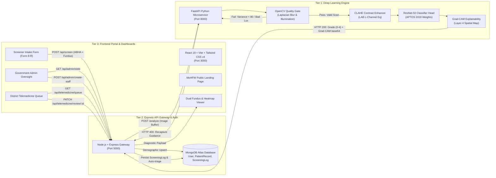

# DRISHTI-AI: Explainable Diabetic Retinopathy Tele-Screening for Rural India

[](https://www.sih.gov.in/)
[](https://fastapi.tiangolo.com/)
[](https://pytorch.org/)
[](https://opencv.org/)
[](https://nodejs.org/)
[](https://expressjs.com/)
[](https://www.mongodb.com/)
[](https://react.dev/)
[](https://tailwindcss.com/)
[](https://www.docker.com/)

**DRISHTI-AI** (*Diabetic Retinopathy Intelligent Screening and Transparent Healthcare Intelligence*) is a defensive, quality-aware, explainable tele-ophthalmology pipeline engineered specifically for Primary Health Centres (PHCs), Sub-Centres, and Community Health Centres (CHCs) in rural and semi-urban India. 

Designed under the **Ayushman Bharat Digital Mission (ABDM)** and Ministry of Health & Family Welfare (MoHFW) guidelines, DRISHTI-AI bridges the critical gap between grassroots community health workers (ASHAs and ANMs) and district hospital ophthalmologists. It automatically evaluates optical capture quality, enhances microvascular contrast, triages fundus scans across the 5 International Clinical Diabetic Retinopathy (ICDR) stages, renders visual Grad-CAM attention heatmaps to eliminate "black-box" skepticism, and facilitates bi-directional tele-consultation and administrative oversight.

---

## Problem Context & Clinical Need

India is home to over **77 million people living with diabetes**, a figure projected to exceed 100 million by 2030. Approximately 1 in 5 diabetic individuals in India develops Diabetic Retinopathy (DR)—a microvascular complication that remains the leading cause of preventable blindness among working-age adults.

### Challenges in Rural Tele-Ophthalmology:
1. **Severe Specialist Scarcity**: While ~70% of India's population resides in rural areas, over **80% of ophthalmologists are concentrated in urban tier-1 cities**. A single district hospital typically serves 1.5 to 2 million citizens.
2. **Asymptomatic Early Stages**: Diabetic retinopathy develops silently. Patients often seek clinical care only when irreversible vision loss has occurred.
3. **Artifact-Heavy Rural Acquisitions**: Low-cost handheld fundus cameras used by frontline ASHA workers frequently produce blurred, underexposed, or off-center captures due to patient motion, pupil constriction, or ambient lighting issues. Standard AI models produce erroneous diagnoses when fed ungradable images.
4. **"Black-Box" Reluctance**: Clinicians and district ophthalmologists hesitate to trust raw statistical predictions without visual anatomical evidence justifying referral decisions.
5. **Lack of District-Level Oversight**: Administrative health officers lack real-time epidemiological visibility into regional screening volumes, operator quality pass rates, and disease prevalence across primary health stations.

---

## System Architecture

DRISHTI-AI is architected into three decoupled, production-ready tiers designed for low-latency inference, reliability, and modular deployment:



### End-to-End Pipeline Flow

```
[ ASHA Worker / PHC Screener ] ── (Captures Handheld Fundus Scan)
                 │
                 ▼
[ React 18 Tele-Ophthalmology Portal :3000 ] 
                 │── Form 8-R Intake: ABHA ID, Name, Age, Blood Glucose
                 │── Clean Default State with Optional "Fill Demo Data"
                 │── Stage Sample Fundus Image (Presets: Grade 0 - 4 & Blurry)
                 │── Click "Run AI Screening Pipeline"
                 │
                 ▼ (HTTP Multipart POST /api/screen)
[ Node.js + Express API Gateway :5000 ]
                 │── Upserts Patient Demographics in MongoDB
                 │── Tags Screener Operator ID & PHC Facility ID
                 │── Forwards Raw Image Buffer to Python Engine
                 │
                 ▼ (HTTP POST /analyze)
[ FastAPI AI Microservice :8000 ]
                 │── 1. OpenCV Optical Quality Gate
                 │      ├── Sharpness: Laplacian Variance Var(∇²I) >= 80.0
                 │      └── Illumination: Mean Pixel Lux μ ∈ [40, 220]
                 │      └── [FAIL]: Returns HTTP 400 + Actionable Recapture Checklist
                 │── 2. Contrast Enhancement: CIE LAB Space + L-Channel CLAHE
                 │── 3. ResNet-50 Deep Inference: APTOS 2019 Fine-Tuned Weights (5 ICDR Classes)
                 │── 4. Grad-CAM Backpropagation: Hooks into model.layer4 for spatial activation map
                 │
                 ▼ (HTTP 200: Severity Grade 0-4, Confidence %, Grad-CAM JPEG base64)
[ Node.js + Express API Gateway :5000 ]
                 │── Evaluates isReferable = (severityGrade >= 2)
                 │── Flags reviewStatus: 'pending_specialist' if Referable
                 │── Persists ScreeningLog linked to PatientRecord
                 │
                 ▼ (Combined Diagnostic & Explainability Payload)
[ Tele-Ophthalmology Workspace & Clinical Action ]
                 ├── Dual Raw Fundus & Grad-CAM Heatmap Viewer (Alpha Blending)
                 ├── Clinical Severity Gauge & Urgent Referral Warning
                 ├── Printable Government Telemedicine Referral Slip (PDF/A4)
                 ├── District Telemedicine Queue Drawer (Ophthalmologist Approval/Override)
                 └── Post-Screening "Clear / Intake New Patient" Workflow
```

---

## Key Innovations

### 1. Automated Optical Quality Gate (OpenCV)
To prevent erroneous inference on compromised captures, raw photographs must pass an automated mathematical quality gate before being ingested into the neural network:
- **Sharpness Variance of Laplacian**:
  $$\text{Blur Score} = \text{Var}\left(\nabla^2 I_{\text{gray}}\right) = \frac{1}{N} \sum_{x,y} \left( \nabla^2 I(x,y) - \mu_{\nabla^2} \right)^2$$
  Acquisitions with $\text{Blur Score} < 80.0$ are immediately halted with `HTTP 400 Bad Request`.
- **Illumination Bounds Checking**:
  $$\mu_{\text{lux}} = \frac{1}{M \times N} \sum_{x=1}^{M} \sum_{y=1}^{N} I_{\text{gray}}(x, y)$$
  Acquisitions with $\mu_{\text{lux}} < 40$ (underexposed/dark) or $\mu_{\text{lux}} > 220$ (flash flare/overexposed) are rejected.
- **Frontline Recapture Guidance**: Rather than a generic error, the gate returns a structured checklist instructing the operator: *"Clean objective lens, instruct patient to fixate on the green LED target, and dim room illumination."*

### 2. Contrast-Limited Adaptive Histogram Equalization (CLAHE)
Handheld retinal images frequently exhibit uneven lighting fall-off at the peripheral margins:
- The input image is converted to the **CIE LAB color space**, decoupling intensity (Luminance $L^*$) from chromaticity ($a^*, b^*$).
- Adaptive histogram equalization with a contrast clipping limit ($\text{clipLimit} = 2.0$) and local contextual grid ($\text{tileGridSize} = 8 \times 8$) is applied exclusively to the $L^*$ channel.
- The enhanced luminance is recombined with original color channels and mapped back to RGB, amplifying microaneurysms and hard exudates without introducing artificial noise.

### 3. 5-Stage Clinical Triage (ICDR Standard)
The classification engine employs a **ResNet-50 backbone fine-tuned on the APTOS 2019 Blindness Detection dataset**:

| Grade | Clinical Designation | Pathological Signs | Referral Action |
|:---:|:---|:---|:---:|
| **0** | **No DR (Normal)** | Clear retina, healthy macula and optic disc | Routine annual follow-up |
| **1** | **Mild NPDR** | Microaneurysms only | Tele-monitoring in 6–12 months |
| **2** | **Moderate NPDR** | Microaneurysms, $<20$ intraretinal hemorrhages, hard exudates | **REFERRAL REQUIRED** (Within 3–4 weeks) |
| **3** | **Severe NPDR** | $>20$ hemorrhages in 4 quadrants, venous beading, IRMA | **URGENT REFERRAL** (Within 1–2 weeks) |
| **4** | **Proliferative DR** | Neovascularization, vitreous/preretinal hemorrhage | **EMERGENT SPECIALIST** (Immediate laser/anti-VEGF) |

*Clinical Rule: Any case with $\text{Severity Grade} \ge 2$ triggers `isReferable = true`, automatically registering the patient into the District Specialist Telemedicine Queue.*

### 4. Grad-CAM Visual Explainability
To satisfy medical transparency standards and eliminate black-box skepticism:
- Gradients of the predicted class score $Y^c$ are backpropagated into the final convolutional feature maps ($A^k$) of `ResNet50.layer4`:
  $$\alpha_k^c = \frac{1}{Z} \sum_{i} \sum_{j} \frac{\partial Y^c}{\partial A_{i,j}^k}$$
  $$L_{\text{Grad-CAM}}^c = \text{ReLU}\left(\sum_{k} \alpha_k^c A^k\right)$$
- The resulting spatial activation map highlights exactly which retinal features (e.g. perimacular exudates, blot hemorrhages) caused the AI's classification.
- The heatmap is normalized, colorized via OpenCV `COLORMAP_JET`, alpha-blended onto the original fundus scan, and streamed to the browser as a base64 JPEG payload.

### 5. Role-Based Access & District Government Admin Oversight
- **MoHFW Portal Homepage**: Public portal with Government of India Ayushman Bharat branding, national tricolor ribbon, technical highlights, and 1-click evaluation credentials.
- **Screener Operator Portal (`/screen`)**: Form 8-R ingestion, dual fundus/heatmap synchronized viewer, clinical disposition gauge, and printable referral passes. Screenings automatically tag the active ASHA operator ID and facility.
- **District Admin Oversight Dashboard (`/admin`)**: Restricted to authenticated District Health Officers (`ADMIN-GOV-01`):
  * **Aggregate Executive KPIs**: Total Screenings Conducted, Referable Cases Identified (Grade 2+), Quality Gate Ungradable Recaptures, and Referral Escalation Rate (%).
  * **PHC Operator Performance Table**: Monitors all active ASHA field stations with total scans, 5-bar ICDR grade distributions (0 to 4), rejection rates, and last-active timestamps.
  * **Patient Screening Audit Log**: Searchable and filterable registry by ABHA ID, operator ID, facility, and referral status.
  * **Staff Onboarding Engine**: Admin modal to register new screener employees (`POST /api/admin/create-staff`) with dynamic ID suggestion (`ASHA-HYD-XXXX`), facility assignment, and instant roster refresh.

---

## Directory Organization

The repository strictly follows an isolated, clean 3-tier architecture:

```
DiaTech/
├── .gitignore                 # Configured root gitignore
├── README.md                  # Comprehensive System Master Documentation
├── deploy/                    # Containerized deployment orchestration
│   └── docker-compose.yml     # 4-Service containerized orchestration
│
├── ai-service/                # TIER 1: Python AI Inference Engine
│   ├── Dockerfile             # Multi-stage Python 3.11 container
│   ├── main.py                # FastAPI endpoints, Quality Gate & Grad-CAM
│   ├── download_samples.py    # Retinal sample asset fetcher
│   ├── requirements.txt       # PyTorch, Torchvision, OpenCV-headless, FastAPI
│   ├── test_service.py        # Microservice test suite
│   ├── verify_3tier_system.py # End-to-end integration test runner
│   ├── static/                # Static viewer assets
│   └── test_assets/           # Pre-calibrated clinical fundus samples
│
├── backend/                   # TIER 2: Node.js Express Gateway
│   ├── Dockerfile             # Node 20 Alpine container
│   ├── package.json           # Express, Mongoose, Axios, Multer, Cors
│   ├── server.js              # Server entry point & DB connection
│   ├── seedUsers.js           # Admin & ASHA account seeder with sample records
│   ├── models/
│   │   ├── User.js            # Admin & Screener credential/role schema
│   │   ├── PatientRecord.js   # ABHA demographics & facility schema
│   │   └── ScreeningLog.js    # AI diagnostic logs & specialist review schema
│   ├── routes/
│   │   ├── authRoutes.js      # POST /api/auth/login, GET /users
│   │   ├── screenRoutes.js    # POST /api/screen (Multer memory & AI proxy)
│   │   ├── telemedicineRoutes.js # GET /queue & PATCH /review/:id
│   │   └── adminRoutes.js     # GET /api/admin/stats, POST /create-staff
│   └── test_gateway.js        # Gateway integration test runner
│
└── frontend/                  # TIER 3: React 18 Tele-Ophthalmology Portal
    ├── Dockerfile             # Multi-stage Vite build + Nginx Alpine
    ├── package.json           # React 18, Vite 6, Tailwind CSS v4, Lucide
    ├── vite.config.js         # Vite configuration
    ├── index.html             # MoHFW HTML entry point
    └── src/
        ├── App.jsx            # Dynamic view router & session manager
        ├── index.css          # Tailwind CSS v4 design system
        ├── main.jsx           # React DOM root
        ├── pages/
        │   ├── LandingPage.jsx     # MoHFW homepage with 1-click evaluation pills
        │   └── AdminDashboard.jsx  # Government oversight KPIs & staff onboarding
        ├── components/
        │   ├── Navbar.jsx                  # Top navigation with facility/operator badges
        │   ├── ScreenerIntakeForm.jsx      # Form 8-R with presets & clean reset controls
        │   ├── DualFundusViewer.jsx        # Side-by-side & alpha-blend Grad-CAM viewer
        │   ├── ClinicalDispositionCard.jsx # ICDR severity gauge & referral card
        │   ├── TelemedicineQueueDrawer.jsx # District specialist triage drawer
        │   ├── UngradableModal.jsx         # Quality Gate optical recapture modal
        │   └── PrintableReferralSlip.jsx   # ABDM-compliant printable referral slip
        └── utils/
            └── api.js         # Centralized Axios API client
```

---

## Quickstart Guide

### Option A: Docker Compose (Recommended)

To launch the complete DRISHTI-AI pipeline with all 4 isolated services (AI Engine, Express Gateway, React Portal, and MongoDB):

```bash
docker compose -f deploy/docker-compose.yml up --build
```

Once initialized, navigate to:
- **Tele-Ophthalmology Portal**: [http://localhost:3000](http://localhost:3000)
- **Node.js Express Gateway**: [http://localhost:5000](http://localhost:5000) (Health: `/health`)
- **FastAPI Model Microservice**: [http://localhost:8000](http://localhost:8000) (API Docs: `/docs`)

---

### Option B: Local Step-by-Step Execution

#### Prerequisites
- **Python 3.10+**
- **Node.js 20+**
- **MongoDB** running locally (`mongodb://127.0.0.1:27017`) or a MongoDB Atlas URI

#### Step 1: Start the Python AI Microservice (`ai-service/`)
```bash
cd ai-service

# Create and activate virtual environment
python -m venv venv
# On Windows:
venv\Scripts\activate
# On Linux/macOS:
source venv/bin/activate

# Install dependencies
pip install -r requirements.txt

# Launch FastAPI microservice
uvicorn main:app --host 0.0.0.0 --port 8000 --reload
```
*Health verification: `http://localhost:8000/health`*

#### Step 2: Start the Express Gateway (`backend/`)
```bash
cd backend

# Install dependencies
npm install

# Start Express server (auto-seeds default accounts on first run)
npm start
```
*Health verification: `http://localhost:5000/health`*

#### Step 3: Start the React Frontend Portal (`frontend/`)
```bash
cd frontend

# Install dependencies
npm install

# Start Vite development server
npm run dev -- --host 0.0.0.0 --port 3000
```
*Access application: `http://localhost:3000`*

---

## Evaluation & Demo Credentials

The system includes pre-seeded demonstration accounts covering administrative oversight and primary health screening:

| Role | Username / ID | Password | Name & Designation | Assigned Health Center |
|:---|:---|:---|:---|:---|
| **District Admin** | `ADMIN-GOV-01` | `admin@drishti2026` | Dr. K. Srinivas (District Health Officer) | Medipally District HQ |
| **PHC Screener** | `ASHA-HYD-1092` | `asha1092` | S. Lakshmi (ASHA Operator) | Medipally Sub-Center |
| **PHC Screener** | `ASHA-HYD-1093` | `asha1093` | P. Sunitha (ASHA Operator) | Boduppal PHC |
| **PHC Screener** | `ASHA-HYD-1094` | `asha1094` | M. Anitha (ASHA Operator) | Peerzadiguda PHC |
| **PHC Screener** | `ASHA-HYD-1095` | `asha1095` | K. Radhika (ASHA Operator) | Uppal Urban Health Post |
| **PHC Screener** | `ASHA-HYD-1096` | `asha1096` | G. Renuka (ASHA Operator) | Ghatkesar Community Health Center |

*Judges Quick Access: The public landing page at [http://localhost:3000](http://localhost:3000) features a dedicated 1-click **"Hackathon Evaluation Credentials"** pill bar to instantly authenticate and inspect either the Screener Portal or the Admin Dashboard.*

---

## API Reference Table

### 1. Python AI Model Service (`:8000`)

| Method | Endpoint | Description | Request Payload | Response Codes |
|:---|:---|:---|:---|:---|
| `GET` | `/health` | Service health & PyTorch engine status | None | `200 OK` |
| `POST` | `/analyze` | Optical Quality Gate, ResNet-50 grading, & Grad-CAM | Multipart form with `fundusImage` (File) | `200 OK` (Gradable)<br/>`400 Bad Request` (Ungradable) |

### 2. Node.js Express Gateway (`:5000`)

| Method | Endpoint | Description | Request Payload | Response Codes |
|:---|:---|:---|:---|:---|
| `GET` | `/health` | Comprehensive gateway, MongoDB, & AI engine health | None | `200 OK`, `503 Service Unavailable` |
| `POST` | `/api/auth/login` | Authenticate staff/admin & start session | `{ userId, password }` | `200 OK`, `401 Unauthorized` |
| `GET` | `/api/auth/users` | Retrieve registered operator roster | None | `200 OK` |
| `POST` | `/api/screen` | Ingest patient demographics & forward fundus image | Multipart form: `fundusImage`, `abhaId`, `patientName`, `age`, `gender`, `bloodGlucoseMgDl`, `operatorId`, `phcId` | `200 OK` (Screened)<br/>`400 Bad Request` (Recapture Required) |
| `GET` | `/api/telemedicine/queue` | Fetch pending specialist referral cases | Query param: `status` (default: `pending_specialist`) | `200 OK` |
| `PATCH` | `/api/telemedicine/review/:id` | Submit specialist confirmation / grade override | `{ reviewStatus, overriddenSeverityGrade, specialistNotes }` | `200 OK`, `404 Not Found` |
| `GET` | `/api/admin/stats` | Executive KPIs, operator performance, & audit logs | None | `200 OK` |
| `POST` | `/api/admin/create-staff` | Admin onboarding of new screener employee | `{ operatorId, fullName, facilityName, phone, password }` | `201 Created`, `409 Conflict` |

---

## Verification & Automated Testing

Automated test suites across all three tiers validate clinical integrity and edge cases:

```bash
# 1. Verify Tier 1 (FastAPI + OpenCV Quality Gate + ResNet-50)
cd ai-service && python test_service.py
# Tests: Health check, blurry rejection (Var < 80), underexposure (mean < 40), overexposure (mean > 220), valid grading

# 2. Verify Tier 2 (Node.js Gateway + MongoDB)
cd backend && npm test
# Tests: MongoDB connection, ABHA ingestion, quality gate proxy, telemedicine queue, specialist review override

# 3. Verify Full 3-Tier Integration
cd ai-service && python verify_3tier_system.py
# Tests: Cross-service HTTP communication, referable escalation logic, and audit logging

# 4. Verify Tier 3 (Frontend Production Build)
cd frontend && npm run build
# Compiles Vite production bundle with Tailwind CSS v4
```

---

## Team & Initiative
 
- **Project**: DRISHTI-AI (Diabetic Retinopathy Intelligent Screening and Transparent Healthcare Intelligence)
- **Initiative**: Smart India Hackathon 2026 (SIH 2026)
- **Domain**: Smart Healthcare / Telemedicine & AI in Rural Diagnostics

---

## License

This project is licensed under the MIT License. Developed for clinical rural tele-screening and public healthcare research under Ayushman Bharat Digital Mission (ABDM) standards.
