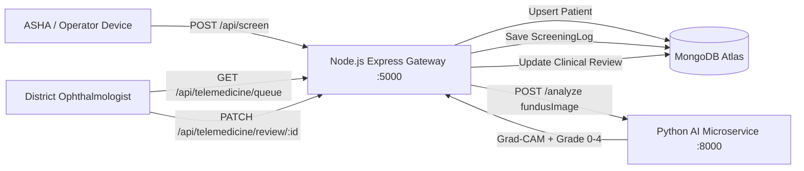

# DRISHTI-AI Telemedicine Gateway (Node.js + Express + Mongoose)

A production-ready Node.js API Gateway that wraps the Python **DRISHTI-AI** microservice (`http://localhost:8000`), integrates with **MongoDB Atlas** via Mongoose, and manages clinical fundus screenings and specialist telemedicine queues.

---

## Architecture Overview



---

## Directory Structure

```
backend/
├── models/
│   ├── PatientRecord.js       # ABHA ID, demographics, facility metadata
│   └── ScreeningLog.js        # AI outputs, Grad-CAM base64, review status
├── routes/
│   ├── screenRoutes.js        # Multer ingestion, upsert & Python proxy
│   └── telemedicineRoutes.js  # Specialist triage queue & review updates
├── test_assets/               # Test image fixtures
├── .env                       # Environment variables
├── .env.example               # Template environment configuration
├── generate_test_images.py    # Generates test fundus photos
├── package.json               # Dependencies & scripts
├── server.js                  # Express initialization & Mongoose connection
└── test_gateway.js            # End-to-end integration test runner
```

---

## Environment Variables (`.env`)

```env
PORT=5000
PYTHON_AI_URL=http://localhost:8000
MONGODB_URI=mongodb://127.0.0.1:27017/drishti_telemedicine
```

---

## API Endpoints

### 1. Ingest & Screen Retinal Image
- **Route**: `POST /api/screen`
- **Content-Type**: `multipart/form-data`
- **Fields**:
  - `fundusImage` (File, required)
  - `abhaId` (String, required)
  - `patientName` (String, required)
  - `age` (Number)
  - `gender` (`Male` | `Female` | `Other`)
  - `bloodGlucoseMgDl` (Number)
  - `operatorId` (String)
  - `phcId` (String)

#### Success Response (`200 OK`)
```json
{
  "success": true,
  "gradable": true,
  "patient": {
    "id": "6aa66d4e539cdefbda412fc0",
    "abhaId": "ABHA-9823-1120-9944",
    "patientName": "Ramesh Sharma",
    "age": 52,
    "gender": "Male",
    "bloodGlucoseMgDl": 185,
    "phcFacilityId": "PHC-RAMPUR",
    "screenerOperatorId": "ASHA-OP-04"
  },
  "screening": {
    "id": "6aa66d4e539cdefbda412fc1",
    "severityGrade": 2,
    "confidence": 23.78,
    "isReferable": true,
    "reviewStatus": "pending_specialist",
    "gradcamImageBase64": "data:image/jpeg;base64,...",
    "createdAt": "2026-09-13T09:30:54.000Z"
  }
}
```

#### Quality Gate Rejection (`400 Bad Request`)
```json
{
  "success": false,
  "gradable": false,
  "patient": {
    "id": "6aa66d4e539cdefbda412fc2",
    "abhaId": "ABHA-4412-8871-3321",
    "patientName": "Sunita Devi"
  },
  "screeningId": "6aa66d4e539cdefbda412fc3",
  "rejectionReason": "Image rejected: Blurry image detected (Laplacian variance 0.00 is below threshold 80.0)",
  "recapturingNotice": "[RECAPTURING REQUIRED] Image rejected: Blurry image detected (Laplacian variance 0.00 is below threshold 80.0). Operator instruction: Please clean lens, adjust lighting, instruct patient to hold fixation, and recapture."
}
```

---

### 2. Telemedicine Queue
- **Route**: `GET /api/telemedicine/queue`
- **Description**: Returns all screenings with `reviewStatus: 'pending_specialist'` sorted newest first, populated with patient details.

---

### 3. Specialist Review & Triage
- **Route**: `PATCH /api/telemedicine/review/:id`
- **Request Body**:
```json
{
  "reviewStatus": "referred_district_hospital",
  "overriddenSeverityGrade": 3,
  "specialistNotes": "Confirmed severe non-proliferative diabetic retinopathy with macular threat. Referred for urgent pan-retinal photocoagulation."
}
```

---

## cURL Usage Examples

```bash
# Gateway Health Check
curl -X GET http://localhost:5000/health

# Ingest Patient & Screen Fundus Photo
curl -X POST http://localhost:5000/api/screen \
  -F "fundusImage=@test_assets/sharp.jpg;type=image/jpeg" \
  -F "abhaId=ABHA-9823-1120-9944" \
  -F "patientName=Ramesh Sharma" \
  -F "age=52" \
  -F "gender=Male" \
  -F "bloodGlucoseMgDl=185" \
  -F "operatorId=ASHA-OP-04" \
  -F "phcId=PHC-RAMPUR"

# View Telemedicine Review Queue
curl -X GET http://localhost:5000/api/telemedicine/queue

# Specialist Review / Referral Override
curl -X PATCH http://localhost:5000/api/telemedicine/review/<SCREENING_ID> \
  -H "Content-Type: application/json" \
  -d '{
    "reviewStatus": "referred_district_hospital",
    "specialistNotes": "Confirmed severe NPDR. Referred to District Hospital."
  }'
```

---

## Running Integration Tests

```bash
cd backend
npm test
```
